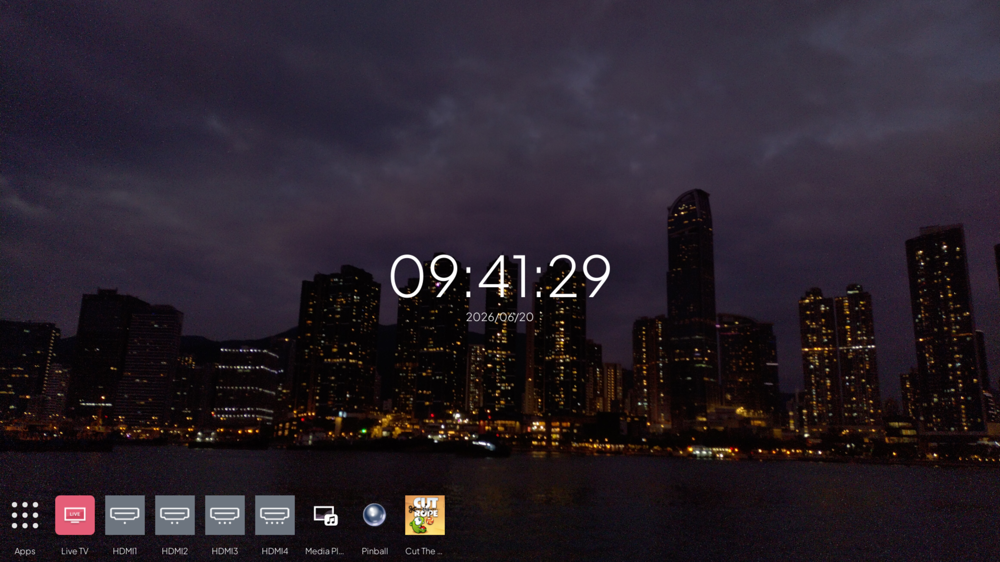

A shitty/hacky custom home screen for webos 6+




It requited `"trustLevel": "trusted",` or webosbrew (with root) to work.

Add `"trustLevel": "trusted",` to appinfo.json if you can run it with  `"trustLevel": "trusted",`.

Side note : useually web os on lg tv wont let developer app's trustLevel to be setted to trusted.

# Compile

Run the fellow command to build it :

```
$ ares-package src

```
# Auto-start

Run the fellow command on the TV to make it auto start by making it as input :

(For webos6+) (Root Needed) (Optional)

```
# luna-send-pub -n 1 'luna://com.webos.service.eim/addDevice' '{"appId":"com.homebrew.openlauncher","pigImage":"access/wallpaper/IMG_20211017_181128.jpg","mvpdIcon":"access/wallpaper/IMG_20211017_181128.jpg","description": "QwQHome :3"}'

```
# Post-Insatll setup for webos 26

If you update/install this app in webos then u would need to run this command and reboot.

(See https://github.com/webosbrew/webos-homebrew-channel/pull/233/changes/caca830efab9f34245cc586746b6acd5ba6fd351)


```
# echo '{"com.homebrew.openlauncher-*":["public"]}'  > /var/luna-service2-dev/client-permissions.d/com.homebrew.openlauncher.app.json 

```

# Replace

If you want it to replace your stock home screen then see [here](./src/access/replace).

# License

 `src/access/wallpaper/*` are under CC-BY-SA license
 `src/access/fallback.png` is proby under Apache License bc it is from in webos oss
 `src/access/plusjakartasans.woff2` is under SIL Open Font License
 `src/access/appbar.svg` is proby under Apache License bc it is from in https://fonts.google.com/

The rest is under  WTFNMFPL.
